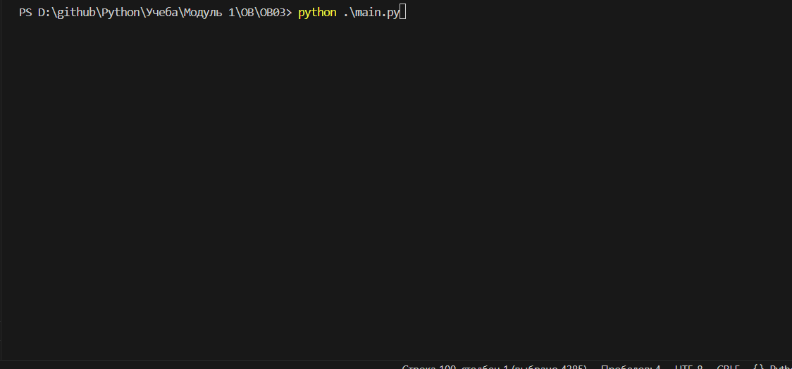

# Zoo Manager

Zoo Manager - это консольное приложение для управления зоопарком. Оно позволяет пользователям добавлять и просматривать животных, а также сотрудников зоопарка.



## Установка

1. Клонируйте репозиторий:
   ```bash
   git clone <URL_вашего_репозитория>
   cd <имя_репозитория>

2. Установите зависимости:
pip install -r requirements.txt

## Использование
Запустите приложение командой:
python main.py

##Основное меню
После запуска приложения вы увидите главное меню с выбором:

Animals

Employees

Exit

## Управление животными
Get Animals: Посмотреть список всех животных в зоопарке.

Add Animal: Добавить новое животное в зоопарк.

Bird: Ввести имя, возраст и размах крыльев.

Mammal: Ввести имя, возраст и тип шерсти.

Reptile: Ввести имя, возраст и цвет чешуи.

## Управление сотрудниками
Get Employees: Посмотреть список всех сотрудников зоопарка.

Add Employee: Добавить нового сотрудника в зоопарк.

Zoo Keeper: Ввести имя и возраст.

Veterinarian: Ввести имя и возраст.

## Сохранение данных
Данные автоматически сохраняются и загружаются из файла при запуске приложения.

## Вклад
Если вы хотите внести свой вклад в проект, пожалуйста, создайте pull request или откройте issue с вашими предложениями.

## Лицензия
Этот проект лицензирован под лицензией MIT.