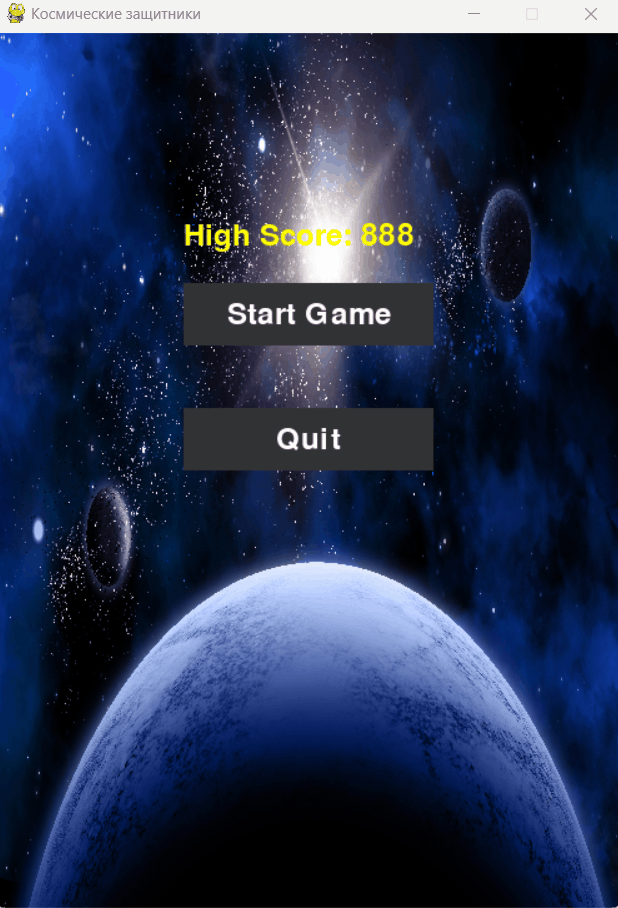

# Космические защитники 🚀

 <!-- Добавьте свой скриншот -->

Космический шутер с защитой от метеоритов, написанный на Python с использованием Pygame.

## Особенности 🌟
- 🕹️ Управление космическим кораблем
- 💥 Стрельба лазерными снарядами
- 🌌 Генерация случайных метеоритов
- 🔥 Система разрушения объектов
- 🏆 Подсчет очков и рекордов
- 🎮 Главное меню и экран Game Over

## Установка ⚙️

1. Клонируйте репозиторий:
```bash
git clone https://github.com/ваш-username/ваш-репозиторий.git

## Управление 🎮
Клавиша    | Действие
-----------|-------------------
← →       | Движение корабля
Пробел    | Стрельба
R         | Рестарт игры
Q/Й       | Выход из игры
Esc       | Возврат в меню

## Зависимости 📦
- Python 3.8+
- Pygame 2.0+
- (Добавьте свои зависимости)

## Структура проекта 📂
.
├── assets/           # Ресурсы игры
│   ├── sounds/       # Звуковые эффекты
│   ├── images/       # Графика
│   └── fonts/        # Шрифты
├── src/              # Исходный код
│   ├── entities/     # Игровые объекты
│   └── ...           # Другие модули
├── main.py           # Точка входа
└── requirements.txt  # Зависимости
