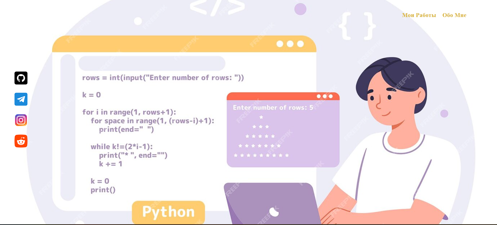

# Портфолио

Мини-сайт с навигацией и контактами.  


## 🚀 Быстрый старт

**Откройте index.html**  
*Скачайте архив*  
*Откройте файл в браузере, или используйте Live Server в VS Code.*

## 📁 Структура проекта
````commandline
├── index.html          # Главная страница  
├── style.css           # Стили  
├── assets/             # Папка с изображениями  
│   ├── background.jpg  # Фон  
│   ├── icon-github.png # Иконка GitHub  
│   ├── icon-telegram.png # Иконка Telegram  
│   ├── icon-instagram.png # Иконка Instagram  
│   └── icon-reddit.png # Иконка Reddit  
└── README.md           # Этот файл  
````

## ✨ Особенности
1. **Адаптивное меню (горизонтальное + вертикальные контакты)**
2. **Фиксированный фон на весь экран**
3. **Иконки соцсетей с hover-эффектом (можно добавить в CSS)**

## 🛠 Автор: *Станислав*