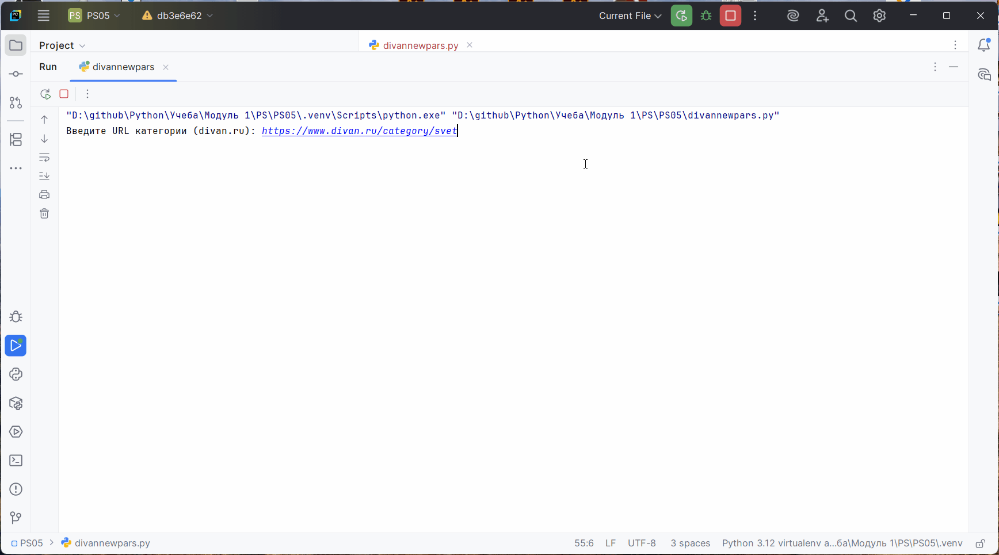

# Парсер товаров Divan.ru

## 🎥 Демонстрация работы

  
Парсер собирает данные о товарах (название, цену и URL) с категорий сайта divan.ru.

## 📌 Особенности
- Поддержка пагинации (автоматический переход по страницам)
- Гибкий входной URL (принимает полные URL или частичные пути)
- Экспорт данных в CSV с корректной кодировкой
- Задержка между запросами (5 сек) для соблюдения правил сайта

🚀 Использование
Запустите парсер и введите URL категории при запросе:

Примеры допустимых URL:

https://www.divan.ru/category/mebel-dlya-detskoj  

/category/mebel-dlya-detskoj

mebel-dlya-detskoj

📊 Выходные данные
Парсер создает CSV-файл с именем категории в формате:

название-категории.csv  
Структура файла:

csv  
name,price,url  
"Кровать Кейси 90 Velvet Coral","29 990","https://www.divan.ru/product/krovat-kejsi-90-velvet-coral"  

⚠️ Ограничения
Требуется точный CSS-селектор для элементов

При изменении структуры сайта потребуется обновление селекторов

Не используйте для массового парсинга (соблюдайте robots.txt)